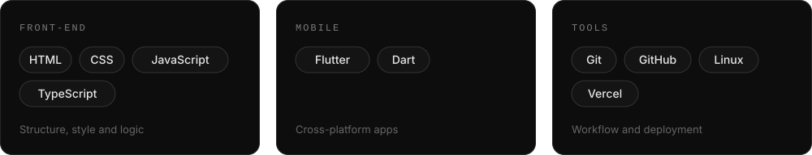
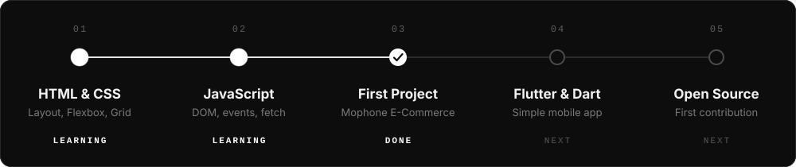

  

 

  
  
  

 

<h2 align="center">ABOUT</h2>

  Mahasiswa Teknik Informatika semester 6 di Universitas Duta Bangsa Surakarta. 
  Membangun antarmuka web dengan React dan Next.js, dengan fokus pada detail kecil 
  yang membuat sebuah produk terasa matang.

  

 

<h2 align="center">TECH STACK</h2>

  

 

<h2 align="center">LEARNING ROADMAP</h2>

  

 

<h2 align="center">HOW I WORK</h2>

<table align="center" width="100%">
  <tr>
    <td width="50%" valign="top">
      <b>Clean first</b> 
      Tampilan rapi dan sederhana lebih penting daripada efek berlebihan.
    </td>
    <td width="50%" valign="top">
      <b>Responsive by default</b> 
      Setiap halaman harus nyaman dibuka di HP maupun laptop.
    </td>
  </tr>
  <tr>
    <td width="50%" valign="top">
      <b>Learn by building</b> 
      Belajar lewat project nyata, bukan hanya menonton tutorial.
    </td>
    <td width="50%" valign="top">
      <b>Commit often</b> 
      Progres kecil tapi konsisten setiap hari.
    </td>
  </tr>
</table>

 

<h2 align="center">PROJECTS</h2>

  

  

 

<h2 align="center">2026 GOALS</h2>

- [x] Publikasikan project front-end pertama: [Mophone E-Commerce](https://mophone.vercel.app)
- [x] Bangun website portofolio pribadi dengan Next.js
- [ ] Perdalam TypeScript dan Next.js
- [ ] Dapatkan posisi magang Frontend Developer
- [ ] Kontribusi ke project open source

 

<h2 align="center">LET'S CONNECT</h2>

  
  
  

  

